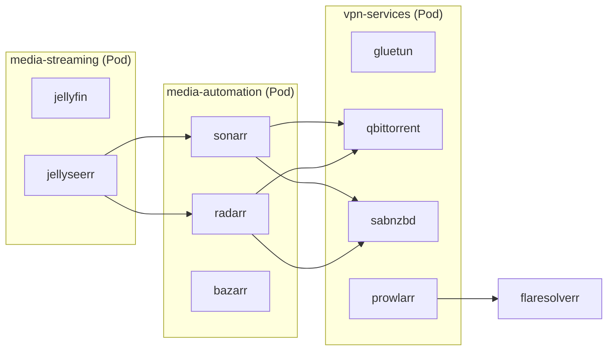

# Running Home Stream Server with Quadlets on Bazzite

This guide covers running the home-stream-server using Podman Quadlet with systemd integration.

## Architecture



## Quick Start

### 1. Copy files to systemd directory

```bash
mkdir -p ~/.config/containers/systemd
cp quadlet/* ~/.config/containers/systemd/
```

### 2. Edit configuration

Open each file and update the `TODO` items:

| File                    | What to change                         |
| ----------------------- | -------------------------------------- |
| `vpn-services.yaml`     | `WIREGUARD_PRIVATE_KEY`, torrents/usenet paths |
| `media-automation.yaml` | Data/media paths                       |
| `media-streaming.yaml`  | Media path                             |

Common values to customize:
- `PUID` / `PGID` – Run `id -u` and `id -g` to get your user's values
- `TZ` – Your timezone (e.g., `America/New_York`)
- Host paths – Replace `/var/home/YOUR_USER/media` with your actual path

### 3. Reload and start

```bash
systemctl --user daemon-reload

# Verify Quadlet generated the units correctly
systemctl --user list-unit-files | grep -E "(vpn|media|flare)"

systemctl --user start vpn-services
systemctl --user start media-automation
systemctl --user start media-streaming
systemctl --user start flaresolverr
```

### 4. Enable autostart (optional)

```bash
systemctl --user enable vpn-services media-automation media-streaming flaresolverr
```

## Service URLs

| Service      | URL                    |
| ------------ | ---------------------- |
| qBittorrent  | http://localhost:8090  |
| SABnzbd      | http://localhost:8080  |
| Prowlarr     | http://localhost:9696  |
| Sonarr       | http://localhost:8989  |
| Radarr       | http://localhost:7878  |
| Bazarr       | http://localhost:6767  |
| Jellyfin     | http://localhost:8096  |
| Jellyseerr   | http://localhost:5055  |
| FlareSolverr | http://localhost:8191  |

## Configuring Service Connections

Use pod hostnames for inter-service communication:

| From → To                   | Host               | Port |
| --------------------------- | ------------------ | ---- |
| Prowlarr → FlareSolverr     | `flaresolverr`     | 8191 |
| Sonarr/Radarr → qBittorrent | `vpn-services`     | 8090 |
| Sonarr/Radarr → SABnzbd     | `vpn-services`     | 8080 |
| Sonarr/Radarr → Prowlarr    | `vpn-services`     | 9696 |
| Jellyseerr → Sonarr         | `media-automation` | 8989 |
| Jellyseerr → Radarr         | `media-automation` | 7878 |

## Managing Services

```bash
# Status
systemctl --user status vpn-services

# Logs
journalctl --user -u vpn-services -f

# Restart
systemctl --user restart vpn-services

# Stop
systemctl --user stop vpn-services
```

## Troubleshooting

### "Unit not found" after daemon-reload

Run the Quadlet generator to check for syntax errors:
```bash
/usr/libexec/podman/quadlet --dryrun --user 2>&1 | grep -i error
```

Then verify units were generated:
```bash
ls ~/.config/containers/systemd/*.service 2>/dev/null || echo "No units generated!"
```

### VPN not connecting
```bash
podman logs vpn-services-gluetun
podman exec vpn-services-gluetun wget -qO- ipinfo.io
```

### Permission errors
```bash
podman unshare chown -R $(id -u):$(id -g) /path/to/volumes
```

## Hardware Transcoding

For Intel QuickSync, uncomment in `media-streaming.kube`:
```ini
AddDevice=/dev/dri
```

And in `media-streaming.yaml`, uncomment the `securityContext` block.

## Files Reference

| File                         | Purpose                      |
| ---------------------------- | ---------------------------- |
| `home-stream.network`        | Shared network for DNS       |
| `vpn-services.yaml/kube`     | VPN + qbit + sab + prowlarr  |
| `media-automation.yaml/kube` | sonarr + radarr + bazarr     |
| `media-streaming.yaml/kube`  | jellyfin + jellyseerr        |
| `flaresolverr.container`     | Cloudflare bypass            |
