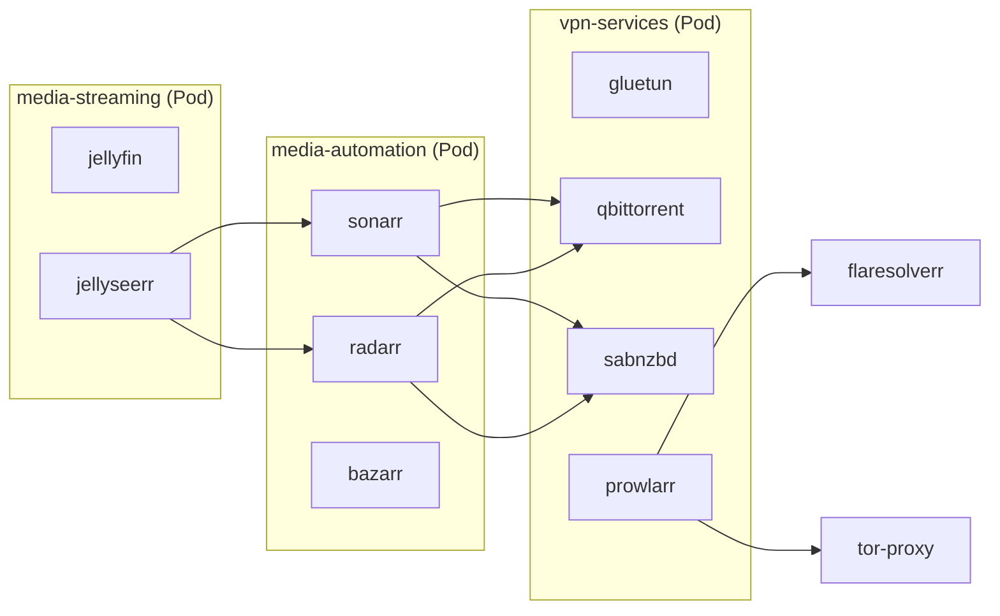

# Running Home Stream Server with Quadlets

This guide covers running home-stream-server using Podman Quadlet with systemd integration. This is ideal for Fedora Atomic, Bazzite, and other immutable distros.

## Architecture



---

## Quick Start (Recommended)

The easiest way to set up Quadlet is using the interactive wizard:

```bash
make setup
# Choose option 2 (Podman Quadlet)
```

This will:
1. Collect your configuration (paths, WireGuard key, etc.)
2. Process templates and install to `~/.config/containers/systemd/`
3. Create a **separate secret file** for your WireGuard key (chmod 600)
4. Set up directory permissions for rootless Podman
5. Configure SELinux contexts (Fedora/Bazzite)
6. Enable lingering for boot-time startup
7. Reload the systemd daemon

---

## Manual Setup

If you prefer manual configuration:

### 1. Configure environment

```bash
# Copy the example environment file
cp .env.example .env

# Edit with your values
nano .env
```

Required values:
- `PUID` / `PGID` – Run `id -u` and `id -g`
- `TZ` – Your timezone (e.g., `America/New_York`)
- `DATA_PATH` – Where to store media (e.g., `/var/home/youruser/media`)
- `WIREGUARD_PRIVATE_KEY` – Your NordVPN WireGuard key

### 2. Install Quadlet files

```bash
# Process templates and install to systemd directory
make quadlet
```

This reads your `.env` and generates the Quadlet files with your configuration.

### 3. Reload and start

```bash
# Reload systemd to pick up new units
systemctl --user daemon-reload

# Verify units were generated
systemctl --user list-unit-files | grep -E "(vpn|media|flare|tor)"

# Start services
systemctl --user start vpn-services
systemctl --user start media-automation
systemctl --user start media-streaming
systemctl --user start flaresolverr
systemctl --user start tor-proxy
```

### 4. Enable boot-time startup

For services to start at system boot (without logging in), you need **lingering**:

```bash
# Enable lingering for your user
sudo loginctl enable-linger $USER

# Enable all services
systemctl --user enable vpn-services media-automation media-streaming flaresolverr tor-proxy
```

Or use:

```bash
make quadlet-enable
```

---

## Permission Gotchas (Rootless Podman)

Rootless Podman runs containers in a user namespace with different UID mapping. This causes permission issues with bind-mounted directories.

### The Problem

When you mount `~/media` into a container:
- On the host: owned by your UID (e.g., 1000)
- In container namespace: appears as a different UID
- Result: "Permission denied" errors

### The Solution

The setup script handles this automatically, but if you have issues:

```bash
# 1. Set ownership within Podman's user namespace
podman unshare chown -R $(id -u):$(id -g) ~/media

# 2. On SELinux systems (Fedora/Bazzite), set the context
podman unshare chcon -R -t container_file_t ~/media

# Or use make:
make permissions
```

### SELinux Context

On Fedora/RHEL/Bazzite, SELinux blocks container access even with correct ownership. You **must** set the `container_file_t` context:

```bash
# Check if SELinux is enforcing
getenforce

# Set context for container access
chcon -R -t container_file_t /path/to/media
```

### Prowlarr Definitions

The custom indexer definitions are copied to `~/.config/containers/systemd/prowlarr-definitions/`. If Prowlarr can't read them:

```bash
chcon -R -t container_file_t ~/.config/containers/systemd/prowlarr-definitions
```

---

## Service URLs

| Service      | URL                   |
| ------------ | --------------------- |
| qBittorrent  | http://localhost:8090 |
| SABnzbd      | http://localhost:8080 |
| Prowlarr     | http://localhost:9696 |
| Sonarr       | http://localhost:8989 |
| Radarr       | http://localhost:7878 |
| Bazarr       | http://localhost:6767 |
| Jellyfin     | http://localhost:8096 |
| Jellyseerr   | http://localhost:5055 |
| FlareSolverr | http://localhost:8191 |

---

## Service Hostnames (Internal)

Use these hostnames for inter-service communication:

| From → To                   | Host                | Port |
| --------------------------- | ------------------- | ---- |
| Prowlarr → FlareSolverr     | `flaresolverr`      | 8191 |
| Prowlarr → Tor Proxy        | `systemd-tor-proxy` | 9050 |
| Sonarr/Radarr → qBittorrent | `vpn-services`      | 8090 |
| Sonarr/Radarr → SABnzbd     | `vpn-services`      | 8080 |
| Sonarr/Radarr → Prowlarr    | `vpn-services`      | 9696 |
| Jellyseerr → Sonarr         | `media-automation`  | 8989 |
| Jellyseerr → Radarr         | `media-automation`  | 7878 |

---

## Managing Services

```bash
# Status
systemctl --user status vpn-services
make quadlet-status

# Logs
journalctl --user -u vpn-services -f
make quadlet-logs

# Restart
systemctl --user restart vpn-services

# Stop all
make quadlet-stop

# Start all
make quadlet-start
```

---

## Troubleshooting

### "Unit not found" after daemon-reload

Check for Quadlet generation errors:

```bash
/usr/libexec/podman/quadlet --dryrun --user 2>&1 | grep -i error
```

Verify files are in the right place:

```bash
ls -la ~/.config/containers/systemd/
```

### VPN not connecting

```bash
# Check gluetun logs
podman logs vpn-services-gluetun

# Verify VPN IP is different from host
podman exec vpn-services-gluetun wget -qO- ipinfo.io
```

### Permission errors

```bash
# Fix ownership in user namespace
podman unshare chown -R $(id -u):$(id -g) ~/media

# Fix SELinux context
podman unshare chcon -R -t container_file_t ~/media
```

### Services don't start at boot

```bash
# Check if lingering is enabled
loginctl show-user $USER | grep Linger

# Enable lingering
sudo loginctl enable-linger $USER

# Enable services
systemctl --user enable vpn-services media-automation media-streaming flaresolverr tor-proxy
```

---

## Hardware Transcoding

For Intel QuickSync, uncomment in `~/.config/containers/systemd/media-streaming.kube`:

```ini
AddDevice=/dev/dri
```

Then restart:

```bash
systemctl --user restart media-streaming
```

---

## Files Reference

Templates are in `quadlet/` and get processed to `~/.config/containers/systemd/`:

| Template File                | Purpose                     |
| ---------------------------- | --------------------------- |
| `home-stream.network`        | Shared network for DNS      |
| `vpn-services.yaml/kube`     | VPN + qbit + sab + prowlarr |
| `media-automation.yaml/kube` | sonarr + radarr + bazarr    |
| `media-streaming.yaml/kube`  | jellyfin + jellyseerr       |
| `flaresolverr.container`     | Cloudflare bypass           |
| `tor-proxy.container`        | Tor SOCKS5 for .onion sites |

### Generated Files (not in git)

| Generated File          | Purpose                        | Security  |
| ----------------------- | ------------------------------ | --------- |
| `wireguard-secret.yaml` | Kubernetes Secret with VPN key | chmod 600 |

The WireGuard private key is stored in a **separate file** that:
- Is created during setup, never committed to git
- Uses Kubernetes Secret format with `secretKeyRef`
- Has restrictive permissions (chmod 600 - owner read/write only)
- Is referenced by `vpn-services.kube` via multiple `Yaml=` directives

### Template Variables

These placeholders are replaced during setup:
- `{{PUID}}`, `{{PGID}}` - User/group IDs
- `{{TZ}}` - Timezone
- `{{DATA_PATH}}` - Media storage path
- `{{SERVER_COUNTRIES}}` - VPN server location
- `{{PROWLARR_DEFINITIONS_PATH}}` - Path to custom indexers

> Note: `{{WIREGUARD_PRIVATE_KEY}}` is NOT in templates - the key goes only in the separate secret file.

